# SYLORA user flows

Twelve end-to-end flows across the 38 screens, plus the cross-cutting states
they share. Companion documents: `docs/design/SCREENS.md` (per-screen
specification), `docs/design/SCREEN_AUTHORING_GUIDE.md` (conventions).

---

## How to read this document

### The product is a screen gallery, not a running application

`src/showcase/App.tsx` mounts one screen at a time. There is no router, no data
layer and no network. `AppShell` accepts an `onNavigate` callback and the
gallery does not pass one, so every shell destination is inert and no screen can
reach another at runtime. Screens read the fixtures in `src/screens/data.ts` and
local module constants; anything described as working is React state
(`useState`) held for the life of the mounted component and lost on reload.

These flows therefore document the **designed path** and mark, at every step,
what a person can actually do today. A flow is not a claim that the sequence
runs.

### Status vocabulary

Every numbered step carries one of four statuses. They are used consistently
across all twelve flows.

| Status | Meaning |
|---|---|
| **Working** | Implemented as component state on the screen. Pressing it changes what is on screen. |
| **Rendered** | The control exists, is labelled and is reachable by keyboard, but has no handler. The design is documented; the behaviour is not implemented. |
| **Handoff** | A move from one screen to another. No handoff in the product is navigable, because the gallery has no router. |
| **Absent** | No surface exists for this step at all. The flow has a gap here. |

### Shell navigation reference

Screens declare a `navId` that maps to a shell destination. Five primary
destinations (`SHELL_NAV`) plus five secondary ones (`SHELL_NAV_SECONDARY`) in
`src/screens/registry.ts`:

| navId | Label | Tier | Screens carrying it |
|---|---|---|---|
| `home` | Home | Primary | `welcome`, `home`, `feed`, `assistant`, `player`, `stories`, `long-video` |
| `discover` | Discover | Primary | `discover`, `shorts`, `communities`, `courses`, `events`, `leaderboards` |
| `live` | Live | Primary | `live-viewer` |
| `messages` | Messages | Primary | `chat`, `messages` |
| `profile` | You | Primary | `profile`, `friends`, `achievements`, `missions` |
| `studio` | Studio | Secondary | `live-studio`, `creator-dashboard` |
| `analytics` | Analytics | Secondary | `analytics` |
| `wallet` | Wallet | Secondary | `monetization`, `wallet`, `gifts`, `inventory` |
| `marketplace` | Marketplace | Secondary | `marketplace`, `digital-products` |
| `settings` | Settings | Secondary | `settings` |

`auth`, `onboarding`, `search`, `notifications`, `premium`, `admin`,
`moderator` and `business` declare no `navId`; they are reached from within
other screens by design, and from nowhere in the gallery.

---

## Flow 1 — First run

| | |
|---|---|
| **Actor** | A person with no account |
| **Entry point** | `welcome` |
| **Exit state** | Signed in, interests recorded, landed on `home` |
| **Screens** | `welcome` → `auth` → `onboarding` → `home` |

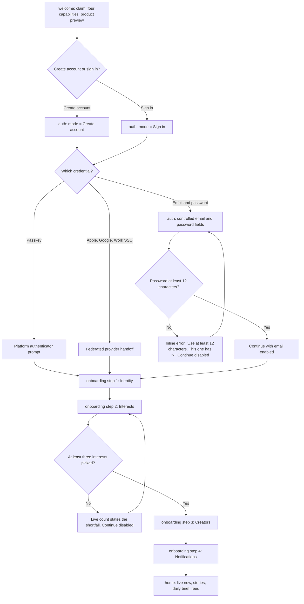

### Narrative

| # | Screen | What happens | Status |
|---|---|---|---|
| 1 | `welcome` | The person reads the claim, the four value propositions and the cost line ("Free below 1,000 followers. No card up front"). The preview stack shows a live tile, a watch-time stat and an assistant proposal built from shipping primitives. | Rendered |
| 2 | `welcome` | Presses the primary or secondary call to action. | Rendered (no handler) |
| 3 | `auth` | Lands on the card. The `Tabs` segmented control selects Create account or Sign in; the heading, subheading, passkey label, password `autoComplete`, the presence of "Forgot password?" and the hint text all change with it. | **Working** |
| 4 | `auth` | Chooses the passkey path, placed above the password fields because it is phishing-resistant. | Rendered |
| 5 | `auth` | Or types an email and a password. Both are controlled inputs; the reveal toggle is an `IconButton` with `aria-pressed`. "Keep me signed in" is a working checkbox. | **Working** |
| 6 | `auth` | In Create account mode, a password under 12 characters produces an inline error naming the current length and disables "Continue with email". Validation runs on every keystroke, not on submit. | **Working** |
| 7 | `auth` | Or picks Apple, Google or Work SSO. Each provider carries its name as text because the icon set ships no third-party brand marks. | Rendered |
| 8 | — | Account creation. | **Absent** — no authentication backend. Nothing submits. |
| 9 | `onboarding` | Step 1, Identity. | **Absent** — named in the progress header only. |
| 10 | `onboarding` | Step 2, Interests. The implemented step. Chips toggle; the aside previews which creators Discover would surface from the current picks and lists each pick as a removable chip; the live count and the Continue button's disabled state both derive from the selection. | **Working** |
| 11 | `onboarding` | Reads "Why we ask", a native `details` disclosure carrying the full commitment: interests feed Discover and never reorder the chronological feed. | **Working** |
| 12 | `onboarding` | Steps 3 (Creators) and 4 (Notifications). | **Absent** — named in the progress header only. |
| 13 | `onboarding` | Presses Continue in the pinned footer. | Rendered |
| 14 | `home` | Arrives at the perishability-ordered home: stories rail, Live now shelf, the assistant's daily brief, then the chronological feed. | Handoff |

### Decision points and branches

- **Create account vs Sign in** changes six things on `auth`, all of them real:
  heading, subheading, passkey button label, password autocomplete, forgot-password
  link and hint text.
- **Passkey vs password vs federated** are three parallel paths. Only the
  password path has any implemented behaviour, and that behaviour is validation.
- **Fewer than three interests** blocks Continue. The reason is printed in an
  `aria-live="polite"` region rather than implied by a greyed-out button.

### Failure and edge cases

| Case | Handling |
|---|---|
| Password too short | Inline, immediate, states the current length. The only error state on the screen. |
| Wrong password, unknown account, rate limiting | **Not designed.** There is no authentication backend to fail. |
| Passkey unavailable on the device | **Not designed.** The button has no fallback state. |
| No interests picked | The aside reads "Pick an interest to see who Discover would suggest." Continue stays disabled. |
| Leaving mid-onboarding | **Not designed.** Nothing persists; there is no resume point. |

### Exit state

`home`, with the shell in whichever posture the content column dictates. On a
393 or 412 column `home` also renders its own in-screen search row, because the
shell's top bar is out of thumb reach on a phone; at 560 and above that row is
hidden as a duplicate control.

---

## Flow 2 — Discovery to follow

| | |
|---|---|
| **Actor** | A signed-in viewer |
| **Entry point** | `home` or `discover` |
| **Exit state** | Following a creator, and notified when they go live |
| **Screens** | `home` / `discover` → `search` → `profile` → `notifications` → `live-viewer` |

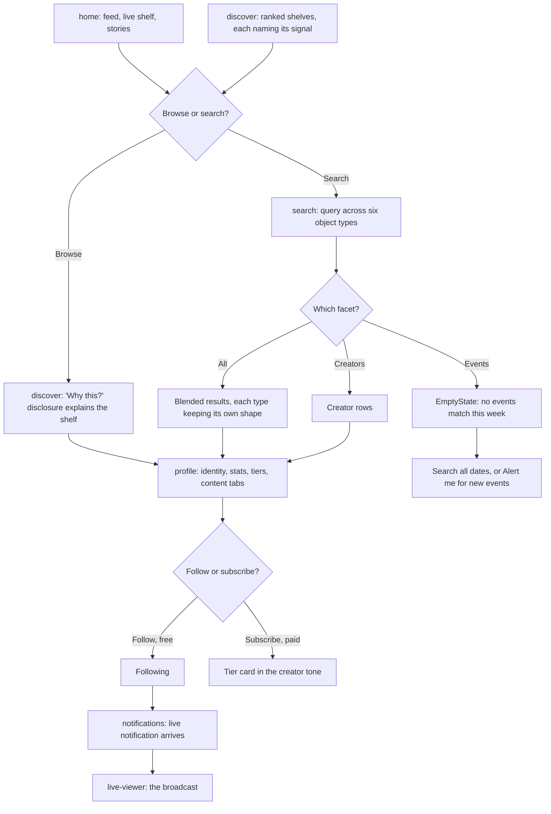

### Narrative

| # | Screen | What happens | Status |
|---|---|---|---|
| 1 | `home` | The viewer scans the feed and the Live now shelf. | Rendered |
| 2 | `discover` | Or opens the ranked surface. Every shelf states the signal that produced it in its eyebrow, and "Why this?" is a disclosure expanding a three-line explanation plus "Tune this shelf". Category chips select one at a time. | **Working** |
| 3 | `search` | Types a query. The `SearchInput` is controlled, Clear works, and the summary sentence interpolates the query and states every active constraint. | **Working** |
| 4 | `search` | Switches result-type tabs: All, Creators, Streams, Posts, Spaces, Products, Events. Counts sit on the tabs so "should I narrow?" is answerable before the click. | **Working** |
| 5 | `search` | Removes or reuses a recent search. Clicking one sets it as the query. | **Working** |
| 6 | `search` | Facet chips (the filter row) render a fixed selected state. | Rendered (not interactive) |
| 7 | `profile` | Opens the creator. Banner, identity, four stats, then actions, then three subscription tiers, then content tabs — "who is this" before "what do I get if I pay". | Handoff |
| 8 | `profile` | Switches between Posts, Streams, Videos, Shop and About. | **Working** |
| 9 | `profile` | Presses Follow. Subscribe sits beside it in the creator tone rather than the brand accent, so a paid action is never taken by muscle memory. | Rendered |
| 10 | `notifications` | Later, the creator goes live. Fixture `n2`: "Dr. Ngozi Adeyemi went live — ROV dive 214", 18m, unread, `kind: 'live'`. | **Working** (as content) |
| 11 | `notifications` | Filters tabs, marks rows read, mutes a kind. Every tab badge recomputes its unread count from current state; "Mark all read" disables itself when nothing is unread and the header switches to "Nothing unread. The last 12 items are kept for 30 days." | **Working** |
| 12 | `live-viewer` | Opens the broadcast. | Handoff |

### Decision points and branches

- **Browse vs search.** `discover` is the explicitly ranked surface and labels
  itself as such; `feed` is strictly chronological and unranked. The split is
  deliberate, and the "Why this?" disclosure exists so ranking can always be
  interrogated.
- **Follow vs subscribe.** Follow is free and belongs to SYLORA; subscribing is a
  transaction with the creator. The colour split is the guard.
- **Which notification tab.** Live notifications are filed under **System**, not
  under a tab of their own: `TAB_KINDS` maps `system` to `['system', 'live']`.
  Someone looking for "who went live" under Mentions or Gifts will not find it.

### Failure and edge cases

| Case | Handling |
|---|---|
| A facet returns nothing | The Events facet is designed as exactly this case, using `EmptyState`: the reason is stated (the next event falls outside the current time filter) with two ways out — "Search all dates" and "Alert me for new events". |
| The whole query returns nothing | **Not designed.** The screen opens on a populated result set for "design tokens". |
| Notifications muted for a kind | The muted notice is an explicit, undoable state with an undo affordance, not a silent filter. |
| Following state not persisted | Follow has no handler; the Friends directory models the state-and-action toggle instead, relabelling itself "Unfollow" on hover and focus. |

### Exit state

Following recorded in the design, a live notification in the System tab, and the
broadcast open on `live-viewer`.

---

## Flow 3 — Watching a live stream and gifting

| | |
|---|---|
| **Actor** | A viewer with a credit balance |
| **Entry point** | `home` Live now shelf |
| **Exit state** | Gift sent, credits deducted, creator notified, gift visible on stream |
| **Screens** | `home` → `live-viewer` → `gifts` → `wallet` → `notifications` → `live-studio` |

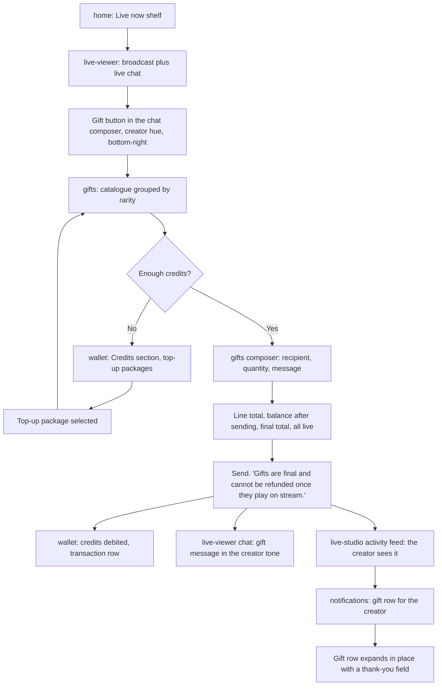

### Narrative

| # | Screen | What happens | Status |
|---|---|---|---|
| 1 | `home` | Opens a tile from the Live now shelf, which is highest on the screen because it perishes soonest. | Rendered |
| 2 | `live-viewer` | The broadcast fills the frame. Chrome is budgeted: chat and controls together never cover more than the bottom 45% on a phone, the top strip is capped at 12%, so a 16:9 stream stays fully visible in the middle band. | Rendered |
| 3 | `live-viewer` | The gift control is the trailing element of the chat composer, in the creator hue, at the bottom-right corner — the single easiest point for a right thumb, and the product's highest-intent action. | Rendered |
| 4 | `gifts` | The catalogue is grouped by rarity, not price. Rarity carries four independent signals: the written tier name, a countable pip row of one to four diamonds, a border that thickens with tier, and hue. | Rendered |
| 5 | `gifts` | Selecting any catalogue tile sets `selected` (`aria-pressed`), which updates the section eyebrow, the composer's chosen-gift block, the on-stream preview and the send button label. | **Working** |
| 6 | `gifts` | The composer shows the recipient — Priya Raghunathan, `@priya.teaches`, "live now, 8.9K watching", matching stream `s2` in the fixtures — the chosen gift, a quantity stepper, and a message field. | Rendered |
| 7 | `gifts` | The quantity stepper is clamped 1–99 and recomputes the line total, the "Balance after sending" figure and the final total live. The value is `aria-live="polite"`. | **Working** |
| 8 | `gifts` | Balance is the module constant `18420` credits. Send states the irreversibility in words. | Rendered |
| 9 | — | The transaction. | **Absent** — nothing is sent, no balance changes, no ledger exists. |
| 10 | `wallet` | Where the debit would land: Credits is a separate section from euro, with its own balance, expiry warning and top-up packages. Euro is real money that leaves the platform; credits are a closed-loop balance that only buys gifts and boosts. | Rendered |
| 11 | `wallet` | Top-up packages are a working `role="radiogroup"`; the selected package shows a check and the word "Selected". Add credits and Withdraw do not initiate anything. | **Working** (selection only) |
| 12 | `gifts` | The on-stream preview is badged **"Simulation"** so nobody believes the gift already played, and the cheer element is `role="status"`. | Rendered |
| 13 | `live-viewer` | Gift messages appear in the chat list in the creator tone, distinguished by tone *and* an icon *and* the word — never colour alone. | Rendered (as content) |
| 14 | `live-studio` | The creator sees it in the activity feed beside chat. | Rendered (as content) |
| 15 | `notifications` | The creator's gift notification. Fixture `n1`: "marcus_ade sent an Aurora Burst during your stream", 4m, unread. | **Working** (as content) |
| 16 | `notifications` | The gift row is the only type that expands in place, carrying the gift tile and a thank-you field inline, because a reply is the useful next action there. The thank-you field is controlled and its hint states the consequence: "Posts as a reply in the stream chat and pins for 30 seconds." | **Working** |

### Decision points and branches

- **Sufficient balance.** The composer prints balance-after-sending before the
  send button is reachable, so the top-up decision is made before the send, not
  after. There is no implemented insufficient-balance branch — the arithmetic is
  shown, but nothing blocks.
- **Featured limited-edition gift** has its own path: "Send now" straight from
  the featured block, with scarcity stated as numbers ("1,412 of 5,000
  remaining", "28% of the mint left") and a countdown rather than the word
  "limited".

### Failure and edge cases

| Case | Handling |
|---|---|
| Balance too low | **Not designed as a blocking state.** "Balance after sending" would simply go negative; nothing prevents it. |
| Gift sent to an offline creator | **Not designed.** The recipient block hard-codes a live creator. |
| Stream ends mid-gift | **Not designed.** `live-viewer` has no stream-ended, reconnecting or offline state; its connection indicator is static. |
| Refund | Explicitly refused in copy: gifts are final once they play on stream. |

### Exit state

Designed: credits debited, gift played on stream, creator notified with a
one-tap thank-you. Implemented: a composer that computes the arithmetic
correctly and a preview badged as a simulation.

> **Infrastructure note.** There is no payment or ledger infrastructure. Credit
> balances, euro balances, top-up packages, Add credits and Withdraw are all
> constants and inert controls across `wallet`, `gifts` and `monetization`.

---

## Flow 4 — Going live as a creator

| | |
|---|---|
| **Actor** | A creator with a scheduled broadcast |
| **Entry point** | `creator-dashboard` |
| **Exit state** | Broadcast ended, performance reviewed on `analytics` |
| **Screens** | `creator-dashboard` → `live-studio` → `analytics` |

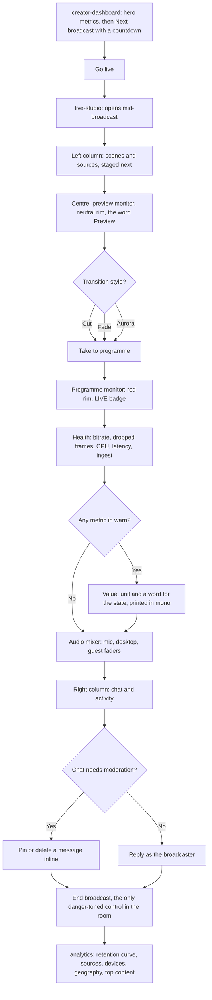

### Narrative

| # | Screen | What happens | Status |
|---|---|---|---|
| 1 | `creator-dashboard` | Reads the four hero metrics, then "Next broadcast" — the only thing on the screen with a deadline, so it gets the accent border, a reminder count and a live countdown. | Rendered |
| 2 | `creator-dashboard` | Switches the range: 7d / 30d / 90d / year, which swaps the four hero metrics. The bar chart is explicitly labelled "last 7 days" and stays fixed, because silently reinterpreting daily buckets as weekly would make two charts wear one label. | **Working** |
| 3 | `creator-dashboard` | Presses **Go live**. This is the only "go live" control in the product. | Rendered |
| 4 | `live-studio` | The control room opens **mid-broadcast**. There is no pre-flight, no confirmation and no countdown to air. | Handoff |
| 5 | `live-studio` | Scene setup happens in the left column: a scene list with thumbnails, then sources. The three columns are three time horizons — left is what is about to happen, centre is now, right is what just happened. | Rendered |
| 6 | `live-studio` | Chooses a transition: Cut, Fade or Aurora, a working `role="radiogroup"`, with a duration field in milliseconds and "Take to programme". The controls sit physically between preview and programme because they are the moment one becomes the other. | **Working** (selection) |
| 7 | `live-studio` | Health check. Bitrate, dropped frames, CPU, latency and a wide ingest cell. No meter is a bare dot: each prints its value in mono, its unit and a word for the state, because a green dot cannot answer "is 4.1% dropped frames bad". One metric renders in the `warn` state. | Rendered (constants) |
| 8 | `live-studio` | Rides the audio mixer. Mic, desktop and guest faders are controlled sliders with per-channel labels. | **Working** |
| 9 | `live-studio` | Moderates chat inline: per-message Pin and Delete controls, each labelled with the message author, plus a moderation-tools button in the chat header and a reply composer ("Reply as Amara"). | Rendered |
| 10 | `live-studio` | On a narrow column the compact Scenes / Chat / Audio switch selects which region is shown, written to `data-panel`. Every region stays mounted, so focus order and landmarks never change with width. | **Working** |
| 11 | `live-studio` | Ends the broadcast. "End broadcast" is the only danger-toned control in the room and is separated from the device toggles by the uptime readout, because ending is irreversible for everyone watching. | Rendered |
| 12 | `analytics` | Reviews the result: six switchable metric tiles, a trend chart with the previous period drawn as a muted dashed line on the same axis, breakdowns by source, device and country, the retention curve with the drop-off marked, and a sortable top-content table. | **Working** |

### Decision points and branches

- **Preview vs programme** is the most expensive confusion available on this
  screen, so the distinction is stated three ways: a red rim versus a neutral
  rim, a LIVE badge versus the word "Preview", and a caption. Never by position
  alone.
- **Transition style** is a real radiogroup, but "Take to programme" does not
  swap the monitors — both are `Media` stills.
- **Health warn** is modelled in the cell design and one metric renders in it,
  but no threshold logic runs.
- **Compact posture** deliberately demotes the room to one column below 992px
  with the monitor pinned first: on a phone a broadcaster is monitoring a stream
  they started elsewhere, so seeing the output and killing it are the only two
  things that must stay one tap away.

### Failure and edge cases

| Case | Handling |
|---|---|
| Ingest drops, encoder fails, bitrate collapses | **Not designed.** No dropped-connection or ingest-failure state exists. The health figures are constants. |
| Accidental End broadcast | Danger tone plus physical separation from the device toggles. No confirmation dialogue is implemented. |
| Going live without a scene staged | **Not designed.** There is no pre-flight check. |

### Exit state

Broadcast ended and `analytics` open on the retention curve. The
"Needs attention" badge on the retention section is an editorial signal in the
fixture, not a computed system state.

> **Infrastructure note.** No encoder is attached. Both monitors are `Media`
> stills, the health figures and uptime are constants, and no broadcast
> lifecycle exists. `live-studio` has no "Go live" control at all — the only
> broadcast-lifecycle button in the room is "End broadcast".

---

## Flow 5 — Publishing long-form content

| | |
|---|---|
| **Actor** | A creator with a finished recording |
| **Entry point** | `creator-dashboard` |
| **Exit state** | Video published, comments accruing, retention reviewed |
| **Screens** | `creator-dashboard` → *(no upload surface)* → `long-video` → `analytics` |

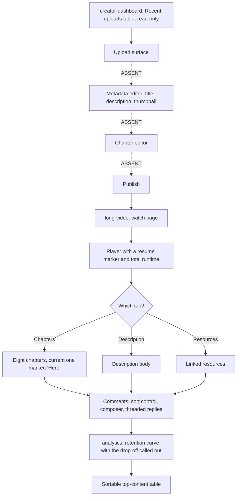

### Narrative

| # | Screen | What happens | Status |
|---|---|---|---|
| 1 | `creator-dashboard` | The "Recent uploads" table lists five published videos with published date, views, watch time and revenue. It is read-only and wrapped in `.sy-table-scroll`, so it keeps its designed column widths and moves overflow into a horizontal scroll rather than clipping numbers. | Rendered |
| 2 | — | Upload. | **Absent** — no video upload surface exists anywhere in the 38 screens. |
| 3 | — | Metadata: title, description, thumbnail, visibility, schedule. | **Absent** for video. The nearest equivalent is the product editor on `digital-products`, which edits digital products, not videos. |
| 4 | — | Chapter authoring. | **Absent.** Chapters exist only as a read-only list of eight on `long-video`. |
| 5 | — | Publish. | **Absent** for video. `digital-products` implements a blocking publish checklist, but for products. |
| 6 | `long-video` | The watch page. Player with a resume marker ("Resume at 1:12:44") and total runtime, then title, view count, date and format badges. | Handoff |
| 7 | `long-video` | The creator row with Subscribe is separated from the reaction group, because following is a relationship decision rather than a reaction to this video. | Rendered |
| 8 | `long-video` | Switches the card between Chapters, Description and Resources. All three answer the same question, so they share one card rather than stacking two and doubling the distance to the comments. | **Working** |
| 9 | `long-video` | Comments — the reason people scroll a watch page — with a sort control, a composer and threaded replies. Like renders pressed (`aria-pressed="true"`); the rest of the action row, the chapter list, the composer and the sort control are inert. | Rendered |
| 10 | `analytics` | Reviews retention. The section calls out the drop-off explicitly, and comparison is always *drawn* rather than stated, because a rise driven by one spike is visibly different from a rise driven by a shifted baseline. | Rendered |
| 11 | `analytics` | Sorts the top-content table. Clicking a header sorts descending, clicking again reverses, switching columns resets to descending, and `aria-sort` plus a visually hidden caption state the current sort in words. | **Working** |

### Decision points and branches

There are no implemented branches in this flow, because the authoring half of it
does not exist. The only real decision is which of Chapters, Description or
Resources to read on the watch page, and which metric and range to review on
`analytics`.

### Failure and edge cases

| Case | Handling |
|---|---|
| Upload fails, transcode fails, publish rejected | **Not designed.** No upload pipeline exists. `admin` mentions VOD publish running late for roughly 4% of uploads as incident copy, which is the only acknowledgement in the product that encoding exists. |
| Video with no comments | **Not designed.** The fixture always has 1,284 comments. |
| Buffering or playback error | **Not designed** on either `long-video` or `player`. On `player` the buffered segment of the scrubber is the only affordance that speaks to network conditions, and it is a static value. |

### Exit state

Designed: a published video accruing comments, with retention reviewed.
Implemented: a watch page and an analytics screen, with nothing connecting them
and no way to create the video in the first place.

> **Infrastructure note.** This is the largest gap between the designed product
> and the implemented one. Neither an upload surface, a metadata editor, a
> chapter editor nor a video publish action exists. The read-only "Recent
> uploads" table and the read-only chapter list are the only evidence in the
> product that videos are published at all.

---

## Flow 6 — Monetization setup

| | |
|---|---|
| **Actor** | A creator approaching partner eligibility |
| **Entry point** | `creator-dashboard` |
| **Exit state** | Revenue streams enabled, payout scheduled |
| **Screens** | `creator-dashboard` → `monetization` → `wallet` |

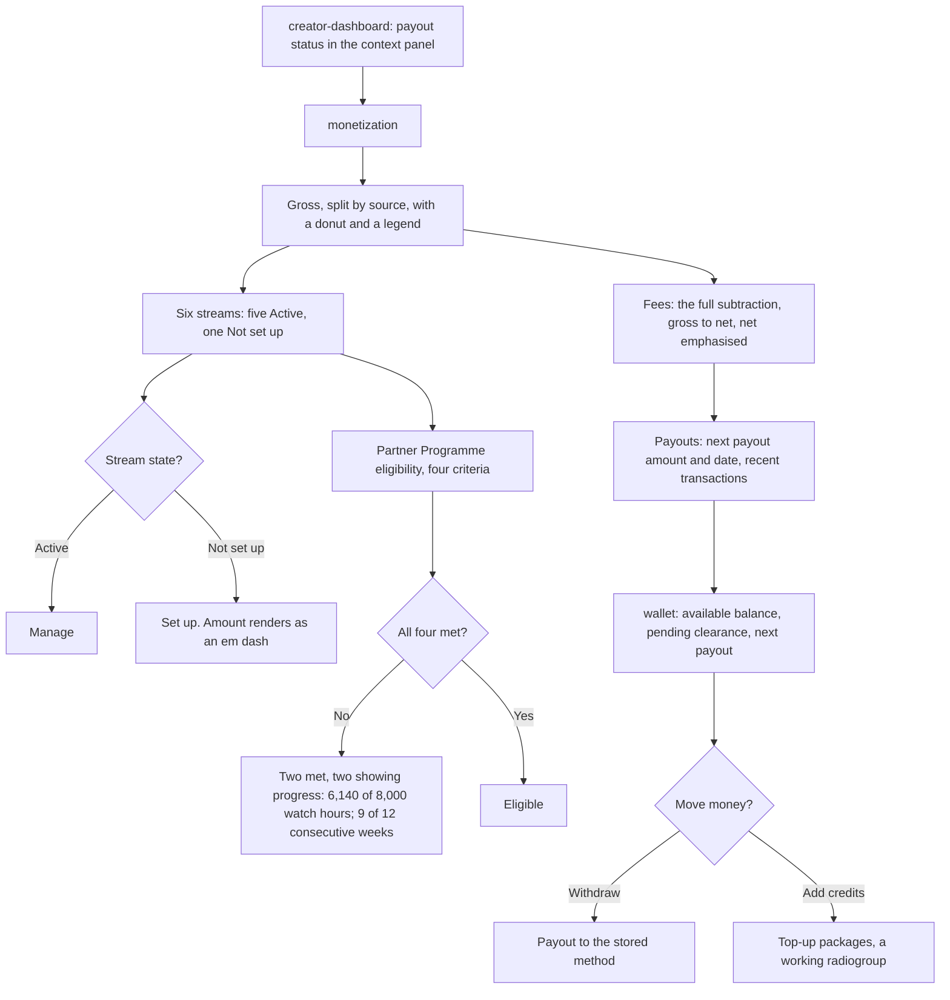

### Narrative

| # | Screen | What happens | Status |
|---|---|---|---|
| 1 | `creator-dashboard` | The context panel carries payout status alongside a today checklist and "Waiting on you" comments. The checklist is working, with four tasks and one pre-checked — including "Upload the remaining tax document". | **Working** |
| 2 | `monetization` | Opens on gross revenue split by source, with a line stating that the subtraction to net is at the bottom of this screen. Money screens usually show the encouraging number and hide the arithmetic; this one is built the other way round. | Rendered |
| 3 | `monetization` | The donut and the six stream cards are generated from one array, so a revenue chart that disagrees with the revenue list beside it is impossible by construction. | Rendered |
| 4 | `monetization` | Five streams are Active — Gifts, Memberships, Marketplace, Courses, Tips. Sponsorships is "Not set up": the card shows an em dash for amount and an outline "Set up" button. | Rendered |
| 5 | `monetization` | Presses Set up or Manage. | Rendered (no handler) |
| 6 | `monetization` | Reads Partner Programme eligibility, kept in a separate panel from earning because they are separate things. Two of four criteria are met (10,000 followers — 12,400, cleared 8 November; tax and payout details — verified 14 January) and two are in progress (6,140 of 8,000 watch hours; 9 of 12 consecutive weeks, "the streak broke over the winter break"). | Rendered |
| 7 | `monetization` | Reads the fee breakdown: the full subtraction from gross to net, with net the only emphasised row because it is the only number the creator can spend. Processing fees are attributed to the acquirer rather than to SYLORA in plain text. | Rendered |
| 8 | `monetization` | Reads the payout panel: next payout amount and date, plus recent transactions. | Rendered |
| 9 | `wallet` | The balance card answers what is mine, what is not mine yet, and how to move it. Available balance sits in display-scale numerals with pending clearance directly beneath at the same alignment, because the gap between those two numbers is what people check most often. | Rendered |
| 10 | `wallet` | Selects a top-up package. A working `role="radiogroup"` with `aria-checked`, showing a check and the word "Selected". | **Working** |
| 11 | `wallet` | Presses Withdraw. | Rendered (no handler) |

### Decision points and branches

- **Active vs Not set up** is the only per-stream branch and it changes the
  badge, the amount cell and the button label.
- **Eligible vs not eligible** is rendered as four independent criteria, each
  carrying an icon *and* a word *and* a visually hidden "— met" / "— not yet
  met" suffix, because a green tick and a grey dash are the same shape to a
  colour-blind reader. Unmet criteria show exact progress rather than a
  percentage alone.
- **Euro vs credits** on `wallet` are separated by section, by glyph and by type
  treatment, so a top-up can never be mistaken for a cash charge. The credit
  glyph is drawn as SVG rather than typeset, so credits are never mistaken for a
  currency with a real exchange rate.

### Failure and edge cases

| Case | Handling |
|---|---|
| Payout fails or is reversed | **Not designed.** Transaction status models Cleared, Pending and Processing as content, each pairing a tone with an icon and a word. |
| Tax details missing | Surfaced as a checklist item on the `creator-dashboard` context panel and as an eligibility criterion on `monetization`. Neither blocks anything. |
| Losing eligibility | Modelled in copy — the consecutive-weeks criterion states that the streak broke — but no state change follows. |

### Exit state

Designed: streams enabled and a payout scheduled. Implemented: an accurate,
self-consistent presentation of the arithmetic, with every action inert.

> **Infrastructure note.** There is no payment infrastructure. Every figure on
> `monetization` and `wallet` — revenue, fee percentages, payout dates, balances
> — is a module constant, and Set up, Manage, Statement, Add credits and
> Withdraw have no handlers.

---

## Flow 7 — Buying in the marketplace

| | |
|---|---|
| **Actor** | A buyer who follows the maker |
| **Entry point** | `discover` or `marketplace` |
| **Exit state** | Product owned and listed in the buyer's library; sale visible to the seller |
| **Screens** | `discover` / `marketplace` → *(no product detail)* → *(no checkout)* → `inventory` → `digital-products` |

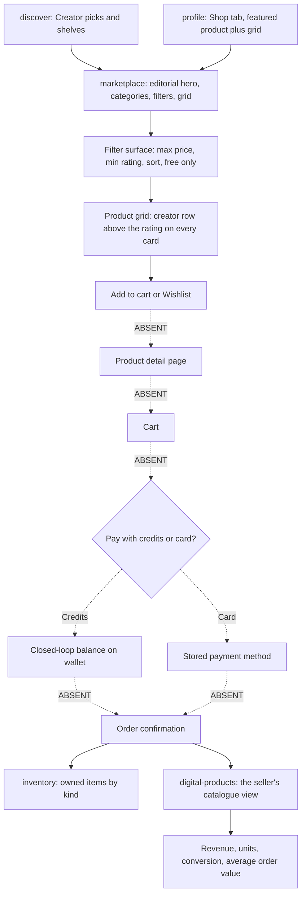

### Narrative

| # | Screen | What happens | Status |
|---|---|---|---|
| 1 | `discover` or `profile` | Arrives from a shelf or from a creator's Shop tab, which carries a featured product plus a grid. | Rendered |
| 2 | `marketplace` | The storefront. The unit of trust is the creator rather than the platform, so the creator row sits above the rating on every card. | Rendered |
| 3 | `marketplace` | The editorial hero shows one product at four times card size with maker, rating, price, previous price, Wishlist and Add to cart. | Rendered |
| 4 | `marketplace` | Narrows by category chips, then by the filter surface: maximum price slider, minimum rating, sort, free-only switch. Filters are a surface rather than a drawer, because on a marketplace the constraint set *is* the query. | **Working** (state only) |
| 5 | `marketplace` | The controls hold and display their own state — the price slider echoes "€0 – €160" in mono — but **the grid is not filtered by them**. No query runs. | **Working** (display only) |
| 6 | `marketplace` | Presses Add to cart. | Rendered (no handler) |
| 7 | — | Product detail page. | **Absent** — the editorial hero is the only expanded product view in the product. |
| 8 | — | Cart. | **Absent** — despite the "Add to cart" label on both `marketplace` and the `profile` Shop tab. |
| 9 | — | Checkout, with credits or card. | **Absent.** `premium` has a checkout block, but it is a static payment-method display for a subscription, not a marketplace checkout. |
| 10 | `inventory` | Where a purchase would land. The screen answers "what am I wearing right now" before "what do I own": four named equipped slots pinned at the top, with empty slots shown rather than hidden. | Rendered |
| 11 | `inventory` | Filters the collection by kind: All / Gifts / Badges / Effects / Frames / Passes, each carrying a live count. | **Working** |
| 12 | `inventory` | Note the mismatch: the collection holds gifts, badges, effects, frames and passes — **not** marketplace products such as LUT packs, overlay kits or sample libraries. A marketplace purchase has nowhere to appear. | — |
| 13 | `digital-products` | The seller's side. Four catalogue stats — revenue, units, conversion, average order value — then Published / Drafts / Archived tabs over the catalogue list. | **Working** (tabs) |
| 14 | `digital-products` | The seller edits one product: title, description, pricing and licence, pay-what-you-want, files. The pay-what-you-want switch reveals a suggested-amount field plus a warning that suggestions above 1.5× the minimum reduce total revenue. | **Working** |

### Decision points and branches

- **Credits vs card** is the flow's central branch and **neither path is
  implemented**. `wallet` states the rule the branch would follow: credits are a
  closed-loop balance that only buys gifts and boosts, euro is real money that
  leaves the platform. On that rule, marketplace products would be a card
  purchase, not a credits purchase.
- **Published / Drafts / Archived** on the seller's side is a real filter over
  the catalogue list.

### Failure and edge cases

| Case | Handling |
|---|---|
| Filters return no products | **Not designed.** This is the notable gap: the filter surface exists precisely to produce a zero-result set, and there is no state for it. |
| Payment declined | **Not designed.** No checkout exists. |
| Seller publishes an incomplete product | **Designed and blocking.** The `digital-products` publish checklist disables Publish, shows "3 of 5 requirements met" with a cross against each unmet item, and states how many remain. Every unmet item is a promise to a buyer that the platform would otherwise have to break on the seller's behalf. |
| Refunds, licences, redownloads | **Not designed** on the buyer's side. Licence terms are editable on the seller's side only. |

### Exit state

Designed: the buyer owns the product and the seller sees the sale. Implemented:
a storefront, a seller's catalogue with a genuinely blocking publish gate, and
no path between them.

> **Infrastructure note.** There is no cart, no product detail page, no checkout
> and no payment processing. `digital-products` is entirely the seller's side of
> the marketplace despite a name that reads like a buyer's surface.

---

## Flow 8 — Enrolling in a course and earning a certificate

| | |
|---|---|
| **Actor** | A learner |
| **Entry point** | `courses` |
| **Exit state** | Course completed, certificate issued with a credential id |
| **Screens** | `courses` (all steps live on one screen) |

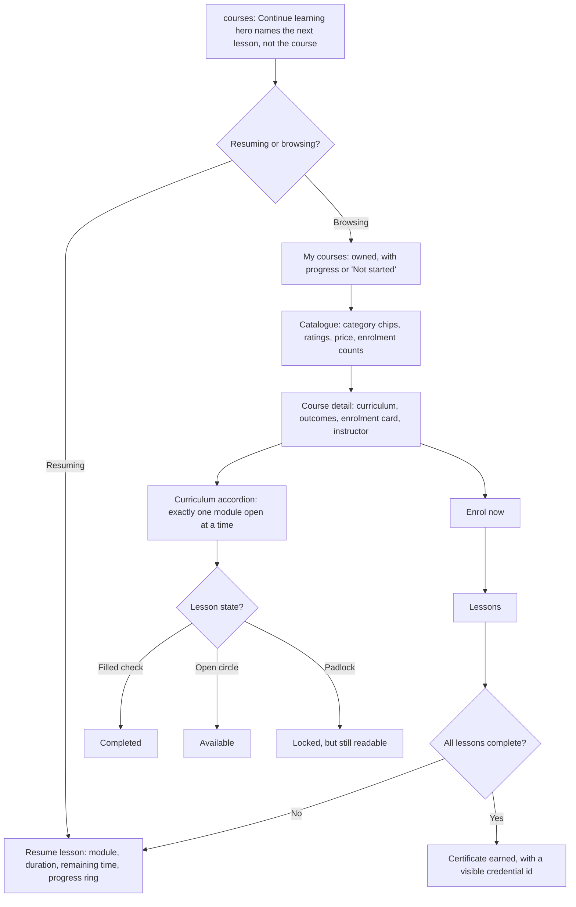

### Narrative

| # | Screen | What happens | Status |
|---|---|---|---|
| 1 | `courses` | The screen is optimised for resuming, not browsing: the single largest predictor of finishing a course is whether it can be resumed in one tap, so the hero names the **next lesson** rather than the course, with its module, duration, remaining time, a progress ring and a progress bar. | Rendered |
| 2 | `courses` | Presses Resume lesson, or the offline download control, or Syllabus. | Rendered (no handler) |
| 3 | `courses` | Scans "My courses", which sits **above** the catalogue: a learning product that sells before it serves teaches people to distrust the home screen. Each card shows per-course progress or a "Not started" marker. | Rendered |
| 4 | `courses` | Filters the catalogue by category chip. | **Working** |
| 5 | `courses` | Reads the course detail section: curriculum and outcomes beside an enrolment card, the instructor, and the certificate. | Rendered |
| 6 | `courses` | Expands a curriculum module. The accordion keeps exactly one module open, clicking the open one closes it, headers use `aria-expanded` and each shows a "done/total" count. | **Working** |
| 7 | `courses` | Presses Enrol now. | Rendered (no handler) |
| 8 | — | Lesson playback. | **Absent** — there is no lesson player screen. `player` is a general video player and is not wired to a course. |
| 9 | `courses` | The certificate is rendered as already earned: a seal, "SYLORA Learning", the course title ("The Darkroom Method"), the recipient, and a visible credential id. It is presented as an artefact rather than a receipt. | Rendered |
| 10 | `courses` | Download PDF, Share and Gift this course. | Rendered (no handler) |

### Decision points and branches

- **Resume vs browse** is the screen's primary split, and the ordering answers
  it before the user does.
- **Lesson state** is carried by three *shapes* — a filled check, an open circle
  and a padlock — so completed, available and locked all survive greyscale.
  Locked rows keep muted-not-quiet text, because a syllabus you cannot read is
  not a preview.
- **Owned vs catalogue** is a content split, not an interaction: the two sections
  are always both present.

### Failure and edge cases

| Case | Handling |
|---|---|
| Enrolment payment | **Not designed.** The enrolment card shows a price; nothing charges. |
| A course with no progress | Designed as content: "Not started" is a marker on the card, not an empty state. |
| Certificate for an incomplete course | Not possible in the fixture — the certificate is rendered in its earned state only. There is no locked or pending certificate state. |
| Offline download | The control exists on the hero and is inert. |

### Exit state

Designed: a completed course and an issued certificate carrying a credential id.
Implemented: every state of the flow rendered as content on a single screen,
with the curriculum accordion and the category chips as the only working
behaviour.

---

## Flow 9 — Joining a community and posting

| | |
|---|---|
| **Actor** | A member or prospective member |
| **Entry point** | `communities` |
| **Exit state** | Member of the space, post visible in the Spaces feed |
| **Screens** | `communities` → `feed` |

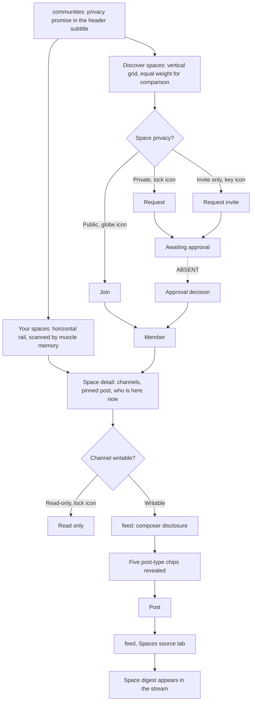

### Narrative

| # | Screen | What happens | Status |
|---|---|---|---|
| 1 | `communities` | The header subtitle states the privacy promise. Two different questions share the screen — "where was I" and "where else could I be" — and they get different layouts for that reason. | Rendered |
| 2 | `communities` | "Your spaces" is a horizontal rail: short, familiar, scanned by muscle memory. | Rendered |
| 3 | `communities` | One space is opened up in full — channels, the pinned announcement, and who is in it right now — because a card can say a space exists but only the inside can say what being a member feels like. | Rendered |
| 4 | `communities` | "Discover spaces" is a vertical grid, because comparing unfamiliar things needs them side by side at equal weight. | Rendered |
| 5 | `communities` | Privacy is stated three redundant ways, any one of which carries the meaning alone: the badge pairs an icon (globe, lock, key) with the word; the join control relabels itself Join / Request / Request invite; and the member counts drop the live "online" figure for spaces you cannot see into. | Rendered |
| 6 | `communities` | Presses Join, Request or Request invite. | Rendered (no handler) |
| 7 | — | The approval decision for a private or invite-only space. | **Absent** — no request queue, no pending state, no moderator approval surface for spaces. |
| 8 | `communities` | Opens a channel. Channels are real buttons in a labelled `nav`, unread counts carry a visually hidden "unread messages", and read-only channels show a lock icon in addition to their styling. | Rendered |
| 9 | `feed` | Posting happens here. The composer is a disclosure (`aria-expanded`) revealing five post-type chips rather than an always-open text area; the chips are hidden with the `hidden` attribute rather than CSS, so they leave the tab order when closed. | **Working** |
| 10 | `feed` | Switches the source: Following / Spaces / Saved. | **Working** |
| 11 | `feed` | The stream is deliberately heterogeneous — a post, a poll, another post, a space digest, then more posts — because a timeline of identical cards hides the fact that spaces post differently from people. | Rendered |
| 12 | `feed` | The end-of-feed marker states what was hidden and why: "You are caught up to 06:14 this morning. 3 older posts from muted spaces were hidden." | Rendered |

### Decision points and branches

- **Public vs private vs invite only** is the flow's real branch, and it is the
  best-signposted decision in the product: three simultaneous signals, none of
  which depends on colour. What differs is only the label on the control and the
  visibility of the online count — the resulting state transition is not
  implemented.
- **Writable vs read-only channel** is signalled with a lock icon rather than by
  the absence of a composer.

### Failure and edge cases

| Case | Handling |
|---|---|
| Join request rejected | **Not designed.** No pending, approved or rejected state exists. |
| Posting to a read-only channel | Prevented by signalling, not by validation: the lock icon and the styling say so, and no composer is offered. |
| Muted spaces hiding posts | Handled explicitly: the end-of-feed marker states the hidden count rather than silently dropping items. |
| An empty space or an empty feed | **Not designed.** Neither screen has an empty state. |

### Exit state

Designed: membership of the space, with the post visible under the Spaces source
on `feed`. Implemented: a working composer disclosure and a working source
switch, with join and post both inert.

---

## Flow 10 — Reporting content and moderating it

| | |
|---|---|
| **Actor** | A reporter (any user), then a moderator |
| **Entry point** | An overflow control on any piece of content |
| **Exit state** | A decision applied to the target, with an appeal route |
| **Screens** | *(no report surface)* → `moderator` → `admin` |

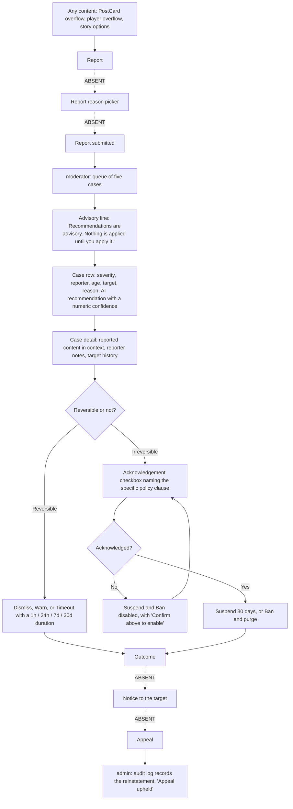

### Narrative

| # | Screen | What happens | Status |
|---|---|---|---|
| 1 | Any content screen | The reporter opens an overflow control — `PostCard`'s "Post options", the player's overflow, the story options button. | Rendered |
| 2 | — | A Report action, a reason picker, evidence capture and a confirmation. | **Absent** — there is no report control, reason picker or confirmation anywhere in the product. Every overflow control is an unlabelled-as-report, inert `IconButton`. The one control in the product containing the word "Report" is "Report an error" on an `assistant` answer. |
| 3 | `moderator` | The queue. Five cases, each carrying severity, reporter, age, target, reason and the AI recommendation with a numeric confidence. The queue never moves; the evidence for the selected case fills the right. | Rendered |
| 4 | `moderator` | Selecting a case swaps the whole detail pane. Each case button uses `aria-current`. | **Working** |
| 5 | `moderator` | Reads the reported content **in context** — the flagged line shown with what came before and after it, carrying a flag icon plus a visually hidden "Reported" — then the reporter notes and the target's history, including prior actions and prior appeals. | Rendered |
| 6 | `moderator` | Reads the recommendation. Confidence is shown as a number because the model's output is a calibrated probability and the job of the screen is to let a human decide how much of it to trust. "High" would cover 0.71 and 0.96 alike, and a number is auditable: a moderator can say "it was 0.63 and I disagreed". | Rendered |
| 7 | `moderator` | Takes a reversible action: Dismiss, Warn, or Timeout with a working duration select (1h / 24h / 7d / 30d). | **Working** (duration only) |
| 8 | `moderator` | Or ticks the acknowledgement checkbox, which names the specific policy clause. Suspend and Ban are `disabled` until it is ticked, with "Confirm above to enable" printed beside them. | **Working** |
| 9 | `moderator` | Selecting a different case **resets the acknowledgement**, because carrying it across would mean the moderator confirmed a case they had not opened. | **Working** |
| 10 | `moderator` | Presses Suspend 30 days or Ban and purge. | Rendered — no decision is recorded anywhere. |
| 11 | — | Notice to the target, and the appeal route. | **Absent.** Appeals exist only as data: a case detail reads `appeals: '1 · rejected'`, and the `admin` audit log carries "Reinstated account — Appeal upheld". |
| 12 | `admin` | The outcome would land in the audit log, which is monospaced end to end so times, actors and object ids compare vertically, with automated entries carrying a visually hidden "Automated action". | Rendered |

### Decision points and branches

- **Reversible vs irreversible** is the structural decision on this screen.
  Reversible outcomes sit in the first row; the irreversible pair sits behind an
  acknowledgement gate and is danger-toned.
- **Agree or disagree with the recommendation.** The advisory line — "Recommendations
  are advisory. Nothing is applied until you apply it." — is the screen's standing
  disclaimer, and no action is pre-applied.
- **Decision from the list alone** is deliberately impossible: the actions sit at
  the bottom of the evidence rather than beside the queue.

### Failure and edge cases

| Case | Handling |
|---|---|
| Empty queue | **Not designed.** No empty-queue state. |
| A case with no human reporter | Handled as content: one case reads "Automated detection, no human reporter." |
| A previously rejected appeal on the same target | Shown in the target history so the moderator sees the pattern before deciding. |
| Moderator acts on the wrong case | Mitigated by resetting the acknowledgement on every selection change. |

### Exit state

Designed: an applied decision, a notified target and an appeal route. Implemented:
a triage tool whose selection, acknowledgement gate and timeout duration all
work, and whose decision buttons are the end of the flow.

> **Infrastructure note.** The reporting half of this flow does not exist. The
> `moderator` queue is a fixture of five cases with pre-written AI
> recommendations; no model runs, and no decision is persisted.

---

## Flow 11 — Asking the AI assistant to act

| | |
|---|---|
| **Actor** | A creator |
| **Entry point** | `assistant`, or "Open assistant" on the `home` daily brief |
| **Exit state** | Actions approved or dismissed, with the decision recorded on screen |
| **Screens** | `home` → `assistant` |

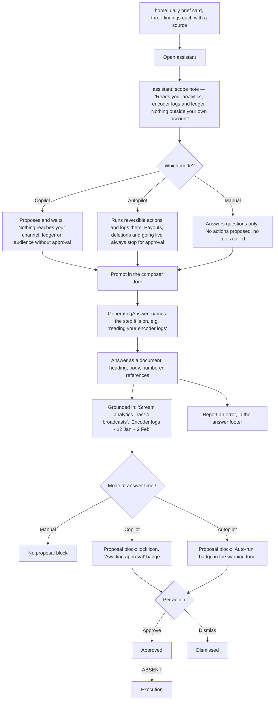

### Narrative

| # | Screen | What happens | Status |
|---|---|---|---|
| 1 | `home` | The daily brief is a **card**, not a chat window: three findings, each with a source-bearing sentence, then "Open assistant" and "Dismiss". On consumer Home the assistant reports; it does not converse. | Rendered (Dismiss does not dismiss) |
| 2 | `assistant` | The header carries a live `AiOrb`, the title, a reasoning badge, a new-conversation control and the scope note. The scope note wraps onto its own line rather than squeezing the title row, so it survives a 393px column without truncation. | Rendered |
| 3 | `assistant` | Sets the mode. The segmented control stays permanently visible in the composer dock, because the mode is what decides whether a proposed action needs approval at all. | **Working** |
| 4 | `assistant` | The note under the composer states the **consequence**, not the name. Copilot: "proposes and waits. Nothing reaches your channel, your ledger or your audience without an explicit approval." Autopilot: "runs reversible actions on its own and writes each one to the activity log. Payouts, deletions and going live always stop for approval." Manual: "answers questions and nothing else. No actions are proposed, and no tools are called." | **Working** |
| 5 | `assistant` | Types a prompt into the controlled `Textarea` in the composer dock, which sits outside the scrolling region at every width so it is always reachable without covering the answer being read. Attach and dictate sit beside it. | **Working** (draft only) |
| 6 | `assistant` | `GeneratingAnswer` renders the in-flight turn and **names the step it is on** rather than showing an anonymous spinner. "Reading your encoder logs" is both a progress indicator and a disclosure of what the assistant is touching. Its `Skeleton` lines are deliberately unequal, because three identical bars read as a loading graphic and uneven ones read as text arriving. | Rendered |
| 7 | `assistant` | The answer arrives as a document, not a chat message: full-width body copy with a heading, where the user's turn is a right-aligned bubble because it is an utterance. The asymmetry makes it legible at a glance who is talking and who is answering. | Rendered |
| 8 | `assistant` | Each paragraph ends in a numbered `sup` reference that resolves in the "Grounded in" row directly beneath — not behind a disclosure, because a citation you have to go looking for is decoration. The fixture cites "Stream analytics · last 4 broadcasts" and "Encoder logs · 12 Jan – 2 Feb". Citations are real buttons with a visible index. | Rendered |
| 9 | `assistant` | The proposal block is separately bordered with a lock icon and an "Awaiting approval" badge. The fixture proposes two actions: "Draft a 20-second transition script" and "Set encoder to pre-warm screen share". | Rendered |
| 10 | `assistant` | Switching to Autopilot changes the block's badge to "Auto-run" in the warning tone and its subtitle to "Autopilot would run these and log them. They are still shown before they happen." | **Working** |
| 11 | `assistant` | Approves or dismisses each action individually. The controls are replaced by an "Approved" or "Dismissed" state. Dismiss controls name the action they dismiss. | **Working** |
| 12 | — | Execution of an approved action. | **Absent** — Approve records a local decision and nothing runs. |
| 13 | `assistant` | Reads aloud, or reports an error from the answer footer. | **Working** (read-aloud toggle) / Rendered |

### Decision points and branches

| Mode | Proposal block | What the note promises | Implemented difference |
|---|---|---|---|
| **Copilot** | Shown, "Awaiting approval", lock icon | Nothing reaches the channel, ledger or audience without explicit approval | The default. Per-action approve/dismiss. |
| **Autopilot** | Shown, "Auto-run", warning tone | Reversible actions run and are logged; payouts, deletions and going live always stop for approval | Badge, tone and subtitle change. The actions are still shown before they happen — nothing runs either way. |
| **Manual** | — | Answers questions only; no actions proposed, no tools called | The mode note changes and is announced. |

The mode note is `aria-live="polite"`, so changing mode announces the new
contract rather than silently changing it.

### Failure and edge cases

| Case | Handling |
|---|---|
| The assistant is wrong | "Report an error" sits in every answer footer, and each claim carries a followable source. |
| The assistant proposes something dangerous | Structural: proposals are a separate bordered block, per-action, with approval required. Autopilot's own copy carves out payouts, deletions and going live. |
| Quota exhausted | The context panel shows a usage stat and a quota progress bar. No exhausted state is implemented. |
| Inference fails or times out | **Not designed.** There is no error turn. |
| Generated content mistaken for the user's own | The aurora hairline is reserved for surfaces the assistant authored, so generated content is always separable. |

### Exit state

Actions marked Approved or Dismissed on screen, with the decision visible in the
turn. Nothing executes.

> **Infrastructure note.** No inference runs. The entire conversation is the
> `AI_CONVERSATION` fixture in `src/screens/data.ts`: one user turn, one
> assistant turn, two citations and two proposed actions. The mode selector
> changes the contract the interface states, not the behaviour of a model.

---

## Flow 12 — Claiming a mission reward

| | |
|---|---|
| **Actor** | A participant in the current season |
| **Entry point** | `missions` |
| **Exit state** | Reward claimed and visible in `inventory` or `wallet`; progress reflected in `achievements` |
| **Screens** | `missions` → `inventory` / `wallet` → `achievements` |

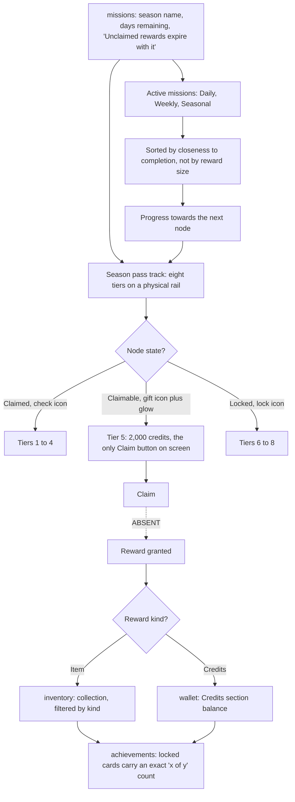

### Narrative

| # | Screen | What happens | Status |
|---|---|---|---|
| 1 | `missions` | The header states the season name, the days remaining, the expiry rule ("Unclaimed rewards expire with it") and the credits earned this season. | Rendered |
| 2 | `missions` | The season pass track is the hero because it is the only thing on the screen that shows **distance**: how far you have come and what the next node costs. Missions are the mechanism; the track is the reason anyone runs them. | Rendered |
| 3 | `missions` | Exactly one node is claimable at a time — tier 5, "2,000 credits" — because a screen with six glowing buttons has no call to action at all. Tiers 1–4 are claimed, 6–8 are locked. | Rendered |
| 4 | `missions` | Every node state carries an icon *and* a word: Claimed (check), Ready to claim (gift), Locked (lock). The claimable node adds a glow, which is decoration on top of a label that already says "Claim". | Rendered |
| 5 | `missions` | The rail's filled portion is the same width as the progress, so there is one truth on screen rather than a bar and a track that can disagree. The rail itself is `aria-hidden`, with progress duplicated as a labelled `Progress` plus an exact "11,400 of 20,000 season points" line. | Rendered |
| 6 | `missions` | Checks the daily streak. Each day carries a visually hidden "complete" / "not yet complete", and the note states the reset rule in words. | Rendered |
| 7 | `missions` | Switches mission tabs: Daily / Weekly / Seasonal, each with a count badge. The list is re-sorted by completion ratio on every switch — sorting by proximity rather than reward size, because finishing something is a stronger pull than earning more, and sorting by reward would bury a mission sitting at 18 of 25. | **Working** |
| 8 | `missions` | Presses Claim on the claimable node. | Rendered (no handler) |
| 9 | — | The grant. | **Absent** — no reward is issued and no node state changes. |
| 10 | `wallet` | A credits reward would land in the Credits section, which has its own balance, an expiry warning and top-up packages, kept visually separate from euro. | Rendered |
| 11 | `inventory` | An item reward — the track also grants a Tide Entrance, a Kiln Frame, a Prism badge and a Supernova — would land in the collection, filterable by All / Gifts / Badges / Effects / Frames / Passes with live counts, and could then be equipped into one of the four loadout slots. | **Working** (filtering only) |
| 12 | `inventory` | "Expiring soon" gets its own band with a countdown in mono, because a badge that vanishes silently feels like theft even when the terms said 30 days. | Rendered |
| 13 | `achievements` | Progress is reflected here. The screen is built around what has **not** been earned yet, because those are the reason to come back: locked cards keep full text contrast and an exact "x of y" count, and are dimmed by saturation and elevation rather than by dropping text contrast below 4.5:1. | Rendered |
| 14 | `achievements` | Filters by tier: All / Bronze / Silver / Gold / Prism, which filters the grid and updates the section eyebrow's count. | **Working** |

### Decision points and branches

- **Credits vs item reward** determines whether the reward lands on `wallet` or
  in `inventory`. The track mixes both — four credit nodes and four item nodes.
- **Claim now vs let it expire** is the pressure the header creates, stated as a
  rule rather than a countdown alone.
- **Which mission tab** re-sorts rather than re-filters by reward, which is the
  deliberate choice described above.

### Failure and edge cases

| Case | Handling |
|---|---|
| Season ends with an unclaimed node | Stated in the header as a rule. No expiry state is implemented. |
| Item expiring in the inventory | Designed: "Expiring soon" is its own band with a countdown and an Extend control. Extend is inert. |
| An empty inventory tab | Would render an empty grid with no message; every tab currently has content. Empty **loadout slots** are different — they are a designed content state with sunken elevation, a label and a Choose button, shown rather than hidden because a gap is the clearest prompt to fill it. |
| Achievement progress that stalls | Achievements always state "x of y" in words as well as a bar, because a bar at 83% does not tell you whether one more publish finishes it or forty. |

### Exit state

Designed: reward claimed, credits or item granted, progress reflected across
`wallet`, `inventory` and `achievements`. Implemented: the tab switching and
tier filtering work; Claim, Equip, Use, Choose and Extend do not.

---

## Cross-cutting states

How loading, empty, error, offline and permission-denied are handled across
every flow above. The short version: two of the five are handled, and the
product handles them by preferring **content states** over **system states**.

### What exists

| State | Instances | Where |
|---|---|---|
| Loading | 1 | `assistant` — `GeneratingAnswer`, using `Skeleton` |
| Empty | 2 | `messages` (Archived tab), `search` (Events facet) — both using `EmptyState` |
| Error | 1 | `auth` — the inline 12-character password rule |
| Offline | 0 | — |
| Permission denied | 0 | — |

### Loading

There is exactly one loading state in the product and it sets the pattern for
any others: **name the step, do not spin.** `GeneratingAnswer` on `assistant`
renders an in-flight turn that states what it is doing — "reading your encoder
logs" — which is simultaneously a progress indicator and a disclosure of what
the assistant is touching. Its `Skeleton` lines are deliberately unequal,
because three identical bars read as a loading graphic and uneven ones read as
text arriving. The turn is labelled "Assistant is answering".

Everywhere else there is nothing to load: screens render module constants and
the fixtures in `src/screens/data.ts`.

### Empty

`EmptyState` appears twice, and both usages follow the same three-part
structure: **say what is empty, say why, offer the way out.**

- `messages`, Archived tab: "Nothing archived", an explanation of what archiving
  does and how to do it, and a "Back to all messages" button that actually
  returns to the All tab. The rationale is explicit — a blank column is
  indistinguishable from a failed load.
- `search`, Events facet: "No events match design tokens this week", the reason
  (the next event falls outside the current time filter), and two ways out —
  "Search all dates" and "Alert me for new events". This is deliberate: real
  queries rarely return nothing overall, they return nothing in one facet, which
  is the case worth designing.

Elsewhere, emptiness is handled as **content** rather than as a system state,
which is the product's consistent preference:

| Screen | Content state | Why it is not an `EmptyState` |
|---|---|---|
| `inventory` | Empty loadout slots with sunken elevation, a label and a Choose button | A gap is the clearest prompt to fill it, and it explains why some items cannot be equipped together |
| `monetization` | "Not set up" stream cards with an em dash and an outline "Set up" button | The stream exists; it is switched off |
| `courses` | "Not started" markers on owned courses | The course is owned |
| `achievements` | Locked cards at full text contrast with an exact "x of y" | Locked is the reason to come back, not an absence |
| `missions` | Locked track nodes with an icon and the word "Locked" | The reward exists and its cost is legible |
| `notifications` | Header copy for the all-read case: "Nothing unread. The last 12 items are kept for 30 days." | There are still rows on screen |
| `feed` | End-of-feed marker stating the hidden count | Something was hidden, and saying so is the point |

Known gaps: `marketplace` has a filter surface whose purpose is to produce a
zero-result set and no state for it; `admin` filtering to no matches renders an
empty table body with no message; `moderator` has no empty-queue state.

### Error

The only error state is `auth`'s inline password rule, and it establishes three
conventions the rest of the product follows for anything that blocks:

1. **Inline and immediate**, next to the field, validated on keystroke rather
   than on submit.
2. **State the actual value**, not just the rule: "Use at least 12 characters.
   This one has N."
3. **Never rely on a disabled control to explain itself.** Wherever something is
   disabled, the reason is in text beside it.

That third convention is the one applied consistently across screens that have
no errors at all:

| Screen | Blocked action | The reason, in text |
|---|---|---|
| `onboarding` | Continue, below three picks | Live count in an `aria-live` region |
| `digital-products` | Publish | "3 of 5 requirements met", with a cross against each unmet item |
| `moderator` | Suspend, Ban | "Confirm above to enable", beside an acknowledgement naming the policy clause |
| `premium` | The Free plan's CTA | It is the current plan |
| `notifications` | "Mark all read" | Nothing is unread, and the header says so |

The product also carries two standing disclaimers rather than error states:
the `moderator` advisory line ("Recommendations are advisory. Nothing is applied
until you apply it.") and the `gifts` on-stream preview badged "Simulation".

### Offline

**Not implemented anywhere.** The places it would surface are identified but
static:

- `live-viewer` has a connection indicator in the top chrome; it is a constant,
  and there is no reconnecting, degraded or stream-ended state.
- `live-studio` models a `warn` state in its health cells and renders one metric
  in it, but no dropped-connection or ingest-failure state exists.
- `courses` has an offline download control on the resume hero; it is inert.
- `player` and `long-video` have no buffering state. The buffered segment of the
  `player` scrubber is the only affordance that speaks to network conditions,
  and it is a static value — though it is deliberately given its own track
  colour, because buffered is the fact that predicts whether a seek will stall.

### Permission denied

**Not implemented anywhere.** No screen gates content behind a role, and the
gallery renders `admin`, `moderator` and `business` to anyone who selects them.
What exists instead is permission modelled as **content**:

- `communities` relabels its join control by privacy — Join, Request, Request
  invite — and drops the live "online" count for spaces you cannot see into.
  There is no denied state, because the request is never submitted.
- `communities` marks read-only channels with a lock icon in addition to their
  styling, rather than showing a composer that rejects input.
- `courses` locks lessons with a padlock shape while keeping the text readable,
  because a syllabus you cannot read is not a preview.
- `business` renders per-member access controls in its team table; they are
  inert.
- `monetization` renders Partner Programme eligibility as four criteria, two met
  and two in progress, without gating anything on the result.

### The consistent principle

Across all five states the product prefers a **legible content state with its
reason printed** over a system state that appears and disappears. Where
something is unavailable it is shown, labelled and explained — an empty loadout
slot, a locked lesson, a "Not set up" revenue stream, a disabled Publish with a
checklist — rather than hidden. Where something genuinely cannot be shown, the
copy states what is missing, why, and what to do next.

The corollary is that the product is **not** designed for failure: there is no
network, no backend and no permission model, so no flow above has an
implemented unhappy path beyond input validation.

---

## Summary of infrastructure gaps

Collected from the notes above, so no flow is read as a working end-to-end path.

| Capability | Status | Affected flows |
|---|---|---|
| Authentication | No backend. Nothing submits; validation only. | 1 |
| Routing between screens | No router. `AppShell` accepts `onNavigate`; the gallery passes none. | All |
| Persistence | None. All state is component state, lost on reload. | All |
| Payments and ledger | None. Balances, payouts, fees and top-ups are constants; Add credits, Withdraw, Set up and Manage are inert. | 3, 6, 7, 12 |
| Cart and checkout | Absent. "Add to cart" exists on `marketplace` and `profile` with no cart behind it. | 7 |
| Product detail page | Absent. The editorial hero is the only expanded product view. | 7 |
| Video upload, metadata and chapter authoring | Absent. Chapters are read-only on `long-video`. | 5 |
| Encoding and broadcast lifecycle | None. Monitors are stills, health figures are constants, and `live-studio` has no "Go live". | 4, 5 |
| AI inference | None. `assistant` renders the `AI_CONVERSATION` fixture; Approve records a local decision. | 11 |
| Content reporting | Absent. No report control, reason picker or confirmation exists. | 10 |
| Moderation persistence | None. Decisions are the end of the implemented flow. | 10 |
| Appeals | Absent as a surface. Present only as data in case history and the `admin` audit log. | 10 |
| Community join requests | Absent. No pending, approved or rejected state. | 9 |
| Lesson playback and enrolment | Absent. `courses` renders every state as content on one screen. | 8 |
| Reward granting | Absent. Claim, Equip, Use, Choose and Extend are inert. | 12 |
