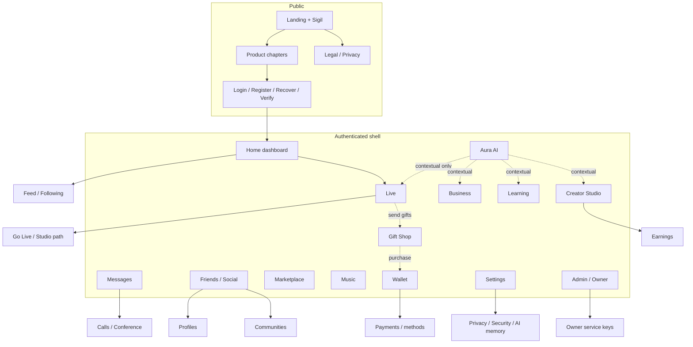

# Ethereal v2 — Navigation map

## Desktop sidebar order
1. Головна  
2. Ефір  
3. Aura  
4. Повідомлення  
5. Друзі  
6. Маркет  
7. Навчання  
8. Бізнес  
9. Музика  
10. Студія творця  
11. Гаманець  
12. Налаштування  

Admin appears only for roles with permission (below Settings or in More).

## Mobile bottom bar
Головна · Ефір · **+** · Повідомлення · Ще  

**Ще** contains: Друзі, Aura, Маркет, Навчання, Бізнес, Музика, Студія, Гаманець, Подарунки, Налаштування, Профіль.

## Anti-duplication
- Wallet appears once in nav.
- Gift Shop appears once (More / sidebar secondary); sending gifts only inside Live.
- Earnings primarily under Creator Studio; Wallet may deep-link once (“Виплати творця”).
