# SYLORA — Product Map

**Purpose:** One ecosystem map. Every feature has exactly one logical home.  
**Shell:** Ethereal design system.  
**Status:** Design review — no implementation yet.

---

## 1. Ecosystem diagram

```mermaid
flowchart TB
  subgraph Public["Public universe"]
    LAND[Landing + Sigil]
    CHAP[Product chapters]
    AUTH[Auth: Login / Register / Recover / Verify]
    LEGAL[Legal: Privacy / Terms]
    LAND --> CHAP
    LAND --> AUTH
    LAND --> LEGAL
  end

  AUTH --> SHELL

  subgraph SHELL["Authenticated shell — one product"]
    TOP[Top bar: Search · Create · Alerts · Profile]
    NAV[Nav: sidebar desktop / bottom mobile]
  end

  SHELL --> HOME
  SHELL --> LIVE
  SHELL --> AURA
  SHELL --> MSG
  SHELL --> SOCIAL
  SHELL --> MKT
  SHELL --> EDU
  SHELL --> BIZ
  SHELL --> MUS
  SHELL --> CS
  SHELL --> WAL
  SHELL --> SET
  SHELL --> ADM

  subgraph HOME["Home"]
    HD[Dashboard]
    FEED[Feed: For you / Following]
    POST[Post detail · Comments · Reactions]
    CREATE[Create post]
    SAVED[Saved]
    NOTIF[Notifications]
    SEARCH[Search & discovery]
  end

  subgraph SOCIAL["People"]
    FR[Friends]
    FOL[Followers / Following]
    PROF[Profiles · Edit profile]
    COM[Communities · Community detail]
  end

  subgraph MSG["Messages"]
    LIST[Conversations]
    CHAT[Private / Group chat]
    MEDIA[Media & files]
    TR[AI translation]
    CALLS[Voice · Video · Group · Conference · Screenshare]
    HIST[Call history]
  end

  subgraph AURA["Aura AI — contextual"]
    ORB[Minimized orb]
    TXT[Text chat]
    VOICE[Voice]
    AV[Expanded presence]
    MEM[Memory · Privacy]
    MODES[Modes: Business · Edu · Creator · Live co-host]
    ASET[AI settings]
  end

  subgraph LIVE["Live"]
    DISC[Discovery]
    VIEW[Viewer]
    START[Start · Preflight · A/V setup]
    MH[Multi-host · Guests]
    VR[Voice rooms]
    MOD[Moderation · Reactions · Chat]
    GIFTCTX[Send gifts — Live only]
    DEST[OBS · Virtual Cam · RTMP · Platforms]
    LAN[Live analytics]
  end

  subgraph CS["Creator Studio"]
    CSD[Dashboard]
    SCENE[Scene editor · Overlays · Alerts · Media]
    REC[Recording · VOD · Clips · AI highlights]
    SCH[Scheduling]
    CAN[Analytics]
    MON[Monetization · Earnings · Payouts entry]
  end

  subgraph WAL["Wallet — single money home"]
    BAL[Balance · Transactions]
    PAY[Payment methods · Top-up]
    SUB[Subscriptions link]
  end

  subgraph GIFT["Gift Shop — single gift home"]
    SHOP[Buy / manage gifts]
    PREV[Gift preview]
  end

  subgraph MUS["Music"]
    MHOM[Home · Playlists · Favorites · Recent]
    PLAY[Player]
    AIPl[Mood / AI playlists]
    RIGHTS[Rights & licensing]
  end

  subgraph BIZ["Business"]
    BD[Dashboard · Tasks · Planning · Docs · Team]
    BA[AI business assistant]
    BAn[Analytics · Marketplace tools]
  end

  subgraph EDU["Education"]
    EH[Learning home · Courses · Lessons · Progress]
    TUT[AI tutor · Plans · Certificates · Teacher tools]
  end

  subgraph MKT["Marketplace"]
    MKH[Home · Listing · Detail · Seller]
    CART[Cart · Checkout · Orders · Reviews]
    CP[Creator products]
  end

  subgraph SET["Settings — single config home"]
    ACC[Account · Privacy · Security · Devices]
    PREF[Language · Appearance · Accessibility · Notifications]
    LIVESET[Live · Camera/Audio]
    AISET[AI · Data/Memory]
    BILL[Subscription · Delete account]
    CONN[Connected services]
  end

  subgraph ADM["Admin / Owner — role gated"]
    AD[Dashboard · Users · Moderation · Reports · T&S]
    AP[Payments · Integrations · Infra · Analytics · Audit]
    KEYS[Owner service keys]
  end

  GIFT -. purchase .-> WAL
  LIVE --> GIFTCTX
  GIFTCTX -. inventory .-> GIFT
  CS --> MON
  MON -. payouts .-> WAL
  AURA -. co-host .-> LIVE
  AURA -. assist .-> BIZ
  AURA -. tutor .-> EDU
  AURA -. assist .-> CS
  HOME --> NOTIF
  HOME --> SEARCH
  MSG --> CALLS
```

---

## 2. Navigation (canonical)

### Desktop sidebar (order)
1. Головна (Home)  
2. Ефір (Live)  
3. Aura  
4. Повідомлення  
5. Друзі  
6. Маркет  
7. Навчання  
8. Бізнес  
9. Музика  
10. Студія  
11. Гаманець  
12. Налаштування  

Gift Shop: under Wallet section link **or** More — **one** entry (`/gifts`), not duplicated on Home.  
Admin: visible only with role.

### Mobile bottom bar
`Головна · Ефір · + · Повідомлення · Ще`  
**Ще** = Friends, Aura, Market, Learning, Business, Music, Studio, Wallet, Gifts, Settings, Profile.

---

## 3. Anti-duplication register

| Capability | Single home | Forbidden duplicates |
|---|---|---|
| Balance / top-up / tx | Wallet | Home tile “wallet clone”, Market wallet, Live wallet hub |
| Buy gifts | Gift Shop | Second shop in Wallet or Studio |
| Send gifts | Live contextual sheet | Global send from Home |
| Creator earnings | Studio → Monetization | Parallel earnings app in Wallet (Wallet may deep-link once) |
| AI | Aura module + contextual sheets | Always-on chatbot overlay |
| Account security | Settings | Mini-security pages in profile only as shortcuts → Settings |
| Go Live | Live Start / Studio path | Fake Live without media |

---

## 4. Reachability (≤3 taps rule)

From Home shell, every primary module is:
- Desktop: 1 click sidebar  
- Mobile: 1 tap bottom **or** 2 taps via Ще  

Deep tools (scene editor, admin keys, payout methods) may add 1–2 steps inside module.

---

## 5. Screen index (canonical routes — design names)

See `03-SCREEN-INVENTORY.md` for hi-fi/spec status.  
Product Map owns **structure**; inventory owns **design coverage**.

---

## 6. Map verification checklist

- [x] No second Wallet  
- [x] Gifts: shop vs send separated  
- [x] Aura contextual  
- [x] Settings single home  
- [x] Admin gated  
- [x] Modules linked without becoming separate apps  
- [ ] Founder confirms IA labels (UK naming)  
- [ ] Founder confirms Gift Shop placement (sidebar link vs More-only)
