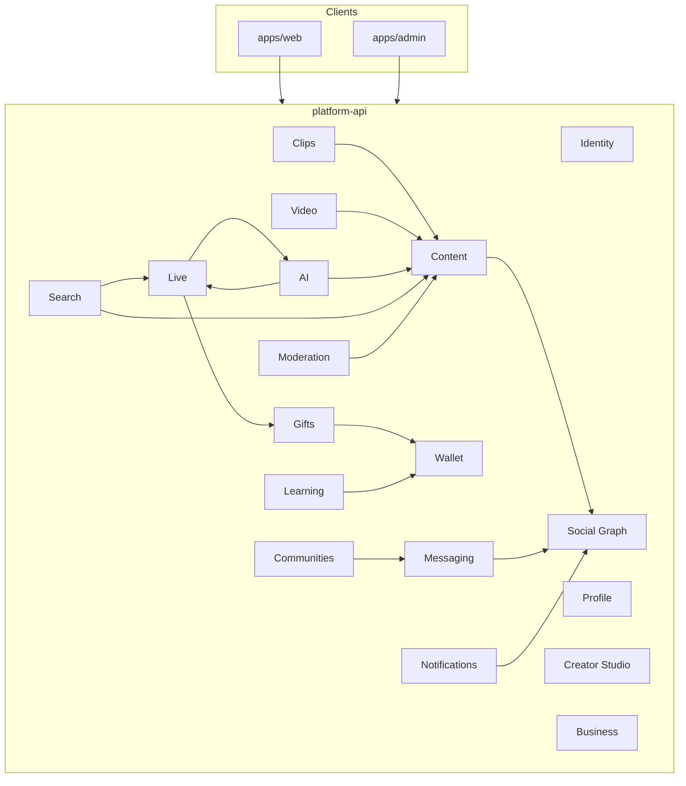

# SYLORA — Domain map

## Context map

## Domain ownership

| Domain | Owns | Publishes events (future) |
|--------|------|---------------------------|
| Identity | users, credentials, sessions, MFA | `user.registered` |
| Profile | display identity, privacy settings | `profile.updated` |
| Social Graph | follows, blocks, friend requests | `graph.followed` |
| Content | posts, comments, reactions, feeds | `content.published` |
| Wallet | ledger entries, balances | `wallet.credited` |
| Gifts | catalog, gift events, renderer manifests | `gift.sent` |
| Live | sessions, chat, viewers | `live.started` |
| AI | conversations, tool grants, memory | `ai.tool.executed` |

## Phase ownership

| Phase | Domains delivered |
|-------|-------------------|
| 0 | Foundation, health, design system shell |
| 1 | Identity, Profile, Social Graph, Content, Notifications, Search (basic), Admin shell |
| 2 | Clips, Video pipeline, Creator analytics |
| 3 | Live, realtime chat |
| 4 | Wallet, Gifts, Gift Engine E2E |
| 5 | AI Assistant, AI Host |
| 6 | Communities, Messaging+, Learning, Business |
| 7 | Native clients, scale hardening |
